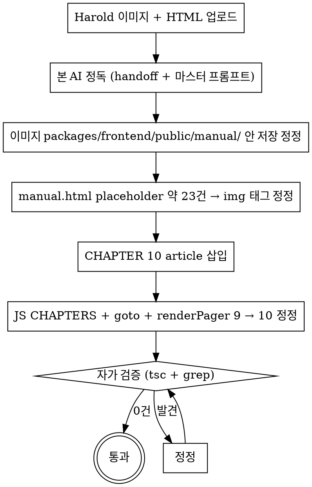

# D224+ 세션 종결 → 다음 세션 진입 핸드오프 (Task #5 매뉴얼 이미지 + CHAPTER 10 신설)

> **작성일**: 2026-05-27 (D224+ 세션 종결 직후)
> **작성자**: 본 AI (Harold 명시 흐름 정합)
> **다음 세션 진입 시 첫 메시지**: 본 핸드오프 정독 + 관련 문서 정독 → Task #5 본격 진입

---

## 1. 본 핸드오프 본질

본 영역 = D224+ 세션 = 6 작업 완료 + 1 작업 다음 세션 진입. 본 다음 세션 = **Task #5 매뉴얼 이미지 입히기 + CHAPTER 10 신설** 본격 진입.

본 작업 = D222+ Phase 5 종결 직후 영역 (매뉴얼 페이지 신규 HTML 정합 + 보안 흐름 통합 완료) + Harold 직접 진행:
- Step A: 스크린샷 캡처 32건 (CHAPTER 01~09)
- Step B: Claude Design 호출 → CHAPTER 10 article HTML 수령
- Step C: 본 AI 정정 진입 (이미지 placeholder + CHAPTER 10 article 삽입 + JS 정정)

---

## 2. 다음 세션 진입 첫 메시지 (Harold 복붙 영역)

```
docs/superpowers/handoffs/2026-05-27-session-d224-handoff.md 정독 +
memory/project_d224_session_completed.md 정독 +
docs/manual/claude-design-master-prompt-chapter10-ai-operator.md 정독 +
memory/project_d222_violet_gradient_unification_completed.md 정독 →
매뉴얼 이미지 입히기 + CHAPTER 10 신설 진입 (Harold 업로드 이미지 32~43건 + Claude Design HTML 활용)
```

---

## 3. Harold 사전 진행 의무

본 AI 다음 세션 진입 직전 Harold 진행 의무:

### Step A: 스크린샷 캡처 32건

운영 진입 (`https://hanjul.ai/dashboard` + 시크릿 모드) → 본 영역 캡처 의무:

| 챕터 | 영역 | 캡처 영역 |
|------|------|---------|
| CHAPTER 01 (3건) | 시작하기 | 메인 대시보드 (DB 현황 모던 6 카드 — D224+ 정정 결과) / DashboardHeader 매뉴얼 NEW 메뉴 / CardDetailModal 본격 디자인 |
| CHAPTER 02 (3건) | 고객 데이터 | 엑셀 업로드 모달 / AI 자동 매핑 결과 / 고객 DB 조회 |
| CHAPTER 03 (4건) | AI 자동발송 | AI Operator 메인 (자연어 + 7 빠른 시작) / AI 자율 진단 / 메시지 3안 + 1-click 액션 / 캠페인 확정 |
| CHAPTER 04 (2건) | 직접발송 | 직접발송 모달 / 변수 적용 미리보기 |
| CHAPTER 05 (2건) | 직접 타겟 | 필터 조건 화면 / AI 자연어 모드 |
| CHAPTER 06 (2건) | 자동발송 | 여정 자동화 메인 / 5단계 위저드 |
| CHAPTER 07 (1건) | 세그먼트 | 자연어 세그먼트 생성 + 미리보기 |
| CHAPTER 08 (3건) | 발송 결과 | 발송결과 목록 / 캠페인 상세 / 캘린더 |
| CHAPTER 09 (3건) | 부가 기능 | AI 발송 템플릿 / 수신거부 관리 / 예약 대기 |

### Step B: Claude Design 호출 → CHAPTER 10 HTML 수령

- 마스터 프롬프트 위치: `docs/manual/claude-design-master-prompt-chapter10-ai-operator.md`
- Claude Design 호출 시 본 마스터 프롬프트 전체 복붙
- 출력 HTML = CHAPTER 10 article + JS 정정 영역 (CHAPTERS 배열 + goto + renderPager 9 → 10)
- 추가 스크린샷 11건 (CHAPTER 10 영역 — AI Operator 10 sub-메뉴 본질) = 총 43건

### Step C: 본 AI 진입 의무 (다음 세션)

Harold 이미지 + Claude Design HTML 수령 직후 본 AI 진입:
1. **이미지 파일 위치**: `packages/frontend/public/manual/` 안 저장 (Harold 업로드 32~43건)
2. **manual.html 안 hero shot placeholder 정정** (CHAPTER 01~09 약 23 placeholder → `<div class="shot"></div>`)
3. **CHAPTER 10 article 신설** (옛 CHAPTER 09 직후 삽입 — Claude Design 출력 HTML 활용)
4. **JS 정정** (manual.html 안 `<script>` 영역):
   - `CHAPTERS` 배열 안 10번 항목 추가
   - `goto(n)` 함수 안 `Math.max(1, Math.min(10, n))` 정정
   - `renderPager` 함수 안 `n < 10 ? CHAPTERS[n] : null` 정정
5. **자가 검증** = frontend tsc + 박-단어 + 옛/진정/영영 + 모델명 grep = 0건
6. **Harold 시각 확인** = 매뉴얼 페이지 진입 시 이미지 + CHAPTER 10 본질 확인

---

## 4. 핵심 참조 문서

- `docs/manual/claude-design-master-prompt-chapter10-ai-operator.md` — Claude Design 마스터 프롬프트 (CHAPTER 10 article 본문 구조)
- `packages/frontend/public/manual/manual.html` — 본 매뉴얼 HTML (D222+ Phase 5 신규 — 1240 라인)
- `memory/project_d222_violet_gradient_unification_completed.md` — D222+ 종결 (매뉴얼 신설 매트릭스)
- `memory/project_d224_session_completed.md` — D224+ 세션 종결 (본 작업 직전 영역)

---

## 5. 다음 세션 진입 직전 의무 (Harold 직접)

1. ✅ 본 D224+ 세션 작업 통합 배포 (tp-push + git pull + backend build:safe + pm2 restart + frontend build:safe)
2. ✅ Dashboard DB 현황 본격 정정 시각 확인 (D222+ Phase 1 신설 5 부분 영구 제거 + 6 카드 모던 디자인 + CardDetailModal 본격 진입)
3. ⏳ 스크린샷 캡처 32건 (CHAPTER 01~09)
4. ⏳ Claude Design 호출 → CHAPTER 10 article HTML 수령
5. ⏳ 추가 스크린샷 11건 (CHAPTER 10 영역)
6. ⏳ 본 AI 새 세션 진입 + 이미지 + HTML 업로드 → 본 AI 정정 진입

---

## 6. 영구 룰 정합 의무 (다음 세션 진입 시)

- ✅ feedback_design_quality_minimum_journey_level — Journey Builder 동급 디자인
- ✅ feedback_no_native_browser_dialog — 매뉴얼 안 alert/confirm/prompt 신규 추가 0건
- ✅ feedback_no_model_name_ui_exposure — 매뉴얼 안 모델명 (Opus/Sonnet/GPT/Claude/Anthropic/Haiku) 추상 명칭만 활용
- ✅ feedback_no_bakkeum_usage — 박-단어 + 옛/진정/영영 grep 0건
- ✅ feedback_no_humuson_keyword_exposure — 휴머스온/Humuson 0건
- ✅ feedback_external_api_response_verification — 외부 API 응답 raw 직접 확인 (해당 영역 X = 매뉴얼 단순)

---

## 7. 본 AI 다음 세션 진입 흐름 매트릭스



---

> **본 핸드오프 종결.** Harold 사전 진행 (배포 + 스크린샷 + Claude Design) 완료 직후 본 AI 새 세션 진입 + Task #5 본격 진입.
