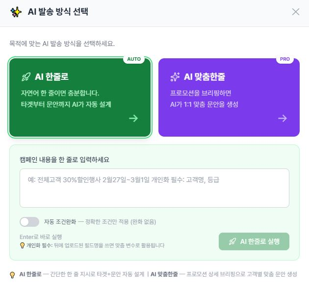

# 한줄로(TargetUp) 사용자 매뉴얼 HTML 제작 요청

> 이 프롬프트와 함께 첨부한 zip 파일에 39개의 스크린샷이 들어있습니다. 압축 해제 후 각 스크린샷을 정확한 위치에 배치하고, 아래 가이드에 맞춰 한 페이지의 깔끔한 HTML 매뉴얼을 제작해주세요.

---

## 0. 결과물 형식

- **단일 HTML 파일** (CSS 인라인 또는 `<style>` 블록)
- **한국어 매뉴얼**
- 좌측에 고정 사이드바(목차) + 우측에 콘텐츠 (스크롤 시 활성 섹션 하이라이트)
- 화면 폭 1280px 기준, 모바일(<768px)에서 사이드바는 햄버거 메뉴
- **인쇄(PDF 변환) 친화** — 페이지 단위 분리(`@media print`)
- 이미지는 파일명 그대로 `` 형태로 참조 (zip 압축 해제 후 같은 폴더 기준)

---

## 1. 서비스 소개 (매뉴얼 첫 페이지에 배치)

**한줄로(TargetUp)** 는 SMS/LMS/MMS 마케팅 자동화 SaaS입니다.
- AI가 자연어 한 줄로 캠페인을 자동 설계
- 5가지 발송 방식 (AI 추천 발송 / 맞춤한줄 / 직접발송 / 직접 타겟 발송 / 자동발송)
- 고객 데이터 자동 매핑 + 개인화 변수 치환
- 발송 결과 실시간 추적 + AI 성과 분석
- 080 수신거부 자동 연동, 스팸필터 사전 검사

**대상 사용자:** 고객사 관리자(admin), 브랜드 담당자(user). 마케팅 담당자가 코딩 없이 즉시 발송 캠페인을 만들 수 있게 설계됨.

---

## 2. 디자인 톤 & 컬러 가이드

### 2-1. 컬러 (한줄로 자체 UI와 일치 — `main.JPG` 참조)

| 용도 | 색상 코드 | 비고 |
|------|----------|------|
| 메인 그린 (AI 추천 발송, 성공 상태) | `#15803d` (emerald-700) / `#10b981` (emerald-500) | 한줄로 메인 컬러 |
| 메인 앰버 (직접 타겟 발송, 강조) | `#f59e0b` (amber-500) / `#b45309` (amber-700) | 보조 액션 |
| 슬레이트 (고객 DB 업로드, 정보) | `#475569` (slate-600) / `#1e293b` (slate-800) | 차분한 액션 |
| 바이올렛 (자동발송, AI 분석) | `#7c3aed` (violet-600) | AI/프리미엄 |
| 본문 텍스트 | `#1f2937` (gray-800) | |
| 보조 텍스트 | `#6b7280` (gray-500) | |
| 카드 배경 | `#ffffff` | 그림자 `shadow-sm` |
| 페이지 배경 | `#f9fafb` (gray-50) | |
| 보더 | `#e5e7eb` (gray-200) | |

### 2-2. 폰트
```css
font-family: 'Pretendard', -apple-system, BlinkMacSystemFont, 'Apple SD Gothic Neo',
             'Malgun Gothic', system-ui, sans-serif;
```

### 2-3. 디자인 원칙
- **카드 기반 UI** — 둥근 모서리(`rounded-xl`), 부드러운 그림자
- **여백 넉넉히** — 정보 밀도가 너무 높지 않게
- **단계별 안내** — 1, 2, 3 번호 매기고 각 단계에 스크린샷 1장
- **친절한 톤** — 존댓말, 마케팅 담당자가 처음 봐도 이해 가능
- **핵심 팁은 박스 강조** — `💡 Tip` 또는 `⚠️ 주의` 박스(emerald/amber 배경)

---

## 3. 매뉴얼 전체 구조 (9장)

목차 사이드바에 다음 9개 챕터를 표시:

```
1. 시작하기 — 메인 대시보드
2. 고객 데이터 관리
3. 한줄로 AI (자연어 발송)
4. 맞춤한줄 (개인화 발송)
5. 직접발송 (수동 입력)
6. 직접 타겟 발송 (조건 필터)
7. 자동발송 (반복 스케줄) ★ 프로 요금제
8. 발송 결과 & 분석
9. 부가 기능 — 수신거부, 예약대기, AI 발송 템플릿
```

각 챕터별 상세 내용은 아래 섹션 참조.

---

## 4. 챕터별 콘텐츠 (정확한 기능 설명)

### 1장. 시작하기 — 메인 대시보드
**스크린샷:** `main.JPG`

**구성 요소 (좌→우, 위→아래 순):**
1. **상단 헤더** — 회사명(예: 주식회사 인비토) + 사용자명 + 세션 타이머(29:50) + 메뉴(자동발송 / 모바일DM / 카카오&RCS / 직접발송 / 발송결과 / 수신거부 / 설정 / 로그아웃)
2. **요금제 현황 카드** — 현재 요금제(예: 프로) + 고객 수(1,501 / 1,000,000명)
3. **발송 현황 카드** — 성공건수 / 평균성공률 / 총 사용금액
4. **DB 현황 카드** — 전체 고객 수 / 등급별 고객 수 (VVIP/VIP/실버 등) / 수신동의 수 + "지난달 대비" 증감 뱃지
5. **우측 큰 카드 3개**:
   - **AI 추천 발송** (그린, MAIN 라벨) — "자연어로 AI가 자동 설계"
   - **직접 타겟 발송** (앰버) — "원하는 고객을 직접 필터링"
   - **고객 DB 업로드** (슬레이트) — "엑셀/CSV로 고객 추가"
6. **하단 4개 카드** — 최근 캠페인(5건) / AI 발송 템플릿(관리) / AI 분석(성과 리포트) / 예약 대기(2건)

**설명 포인트:**
- 메인 화면은 "지금 무엇을 할지" 한눈에 보이도록 액션 카드 중심으로 설계
- 카운트다운 타이머는 30분 무활동 시 자동 로그아웃 (보안)
- 우측 3개 큰 카드는 가장 자주 쓰는 기능 진입점

---

### 2장. 고객 데이터 관리
**스크린샷:** `고객DB업로드.JPG`, `고객DB업로드_데이터매핑.JPG`, `고객DB조회.JPG`, `DB현황_상세화면.JPG`

#### 2-1. 엑셀/CSV 업로드 (`고객DB업로드.JPG`)
- 드래그&드롭 또는 파일 선택
- 지원 형식: .xlsx, .xls, .csv
- 30,000건 단위 분할 업로드 권장

#### 2-2. AI 자동 매핑 (`고객DB업로드_데이터매핑.JPG`)
- AI가 엑셀의 헤더(예: "고객명", "휴대폰번호", "구매금액")를 한줄로 표준 필드(name, phone, total_purchase_amount)로 자동 매핑
- 표준 21개 필드: 이름, 전화번호, 성별, 나이, 생년월일, 이메일, 주소, 지역, 최근구매매장, 최근구매금액, 누적구매금액, 구매횟수, 등급, 포인트, 매장코드, 매장명, 매장전화번호, 등록유형, 등록매장, 수신동의 등
- 커스텀 필드 15개 슬롯 (custom_1~15) — 고객사 고유 필드 (예: "선호스타일", "방문횟수")
- **포인트:** 매핑 미확정 행은 자동으로 커스텀 슬롯에 할당 + 라벨 자동 인식

#### 2-3. 고객 DB 조회 (`고객DB조회.JPG`)
- 활용 필드 동적 표시 — 등록된 필드만 컬럼으로 노출 (DB 현황 ≡ 다운로드 ≡ 대시보드 카드 100% 일치)
- 검색 + 필터 + 페이지네이션
- 우측 상단 다운로드 버튼 — 엑셀 export (한글 헤더 + 커스텀 필드 평면화)

#### 2-4. DB 현황 상세 (`DB현황_상세화면.JPG`)
- 카드 클릭 시 모달 — 6개월 추이 차트 + 4분면 분포(예: 성별/연령) + Top 리스트 + 전체 분포
- 메인 대시보드의 카드는 "고객사가 직접 선택한 카드"로 구성됨 (관리자가 슈퍼관리자에서 카드 풀 설정)

---

### 3장. 한줄로 AI (자연어 발송) ⭐ 가장 추천
**스크린샷:** `한줄로_입력.JPG`, `한줄로_문안추천.JPG`, `한줄로_발송채널선택.JPG`, `캠페인확정.JPG`, `스팸필터테스트.JPG`

**핵심 가치:** "30대 여성 VVIP에게 봄 신상 안내 보내줘" — 한 줄만 적으면 AI가 타겟 추출 + 문안 생성 + 발송까지 자동 설계.

#### 단계별 흐름:
**Step 1. 자연어 입력 (`한줄로_입력.JPG`)**
- 메인 화면의 그린 카드 "AI 추천 발송" 클릭
- 자연어로 캠페인 의도 입력 (예: "어제 가입한 신규 고객에게 환영 메시지", "휴면 고객 깨우기")
- "AI 자동 조건 완화" 토글 — 매칭 0건 시 AI가 조건을 자동 완화 (PRO+ 전용)

**Step 2. 타겟 자동 추출 + 문안 추천 (`한줄로_문안추천.JPG`)**
- AI가 자연어를 해석 → 타겟 필터(예: 성별=여성, 연령대=30대, 등급=VVIP) 자동 생성
- 추출 인원 + 샘플 고객 표시
- AI가 3개 문안 후보 생성 (개인화 변수 `%이름%`, `%등급%` 자동 삽입)
- 사용자가 마음에 드는 문안 선택 또는 직접 수정

**Step 3. 발송 채널 선택 (`한줄로_발송채널선택.JPG`)**
- SMS (90바이트 이내) / LMS (2,000바이트, 제목 포함) / MMS (이미지 첨부)
- (광고) 표시 + 무료 080 수신거부 번호 자동 부착 (KISA 정책 준수)
- 즉시 발송 / 예약 발송 선택

**Step 4. 스팸필터 사전 테스트 (`스팸필터테스트.JPG`)**
- 발송 전 테스트폰(SKT/KT/LGU+) 3대로 자동 검사
- 차단 시 AI가 문안 자동 재생성 (최대 2회) — 프로 요금제 자동화
- 통과한 문안만 실제 발송에 사용

**Step 5. 캠페인 확정 (`캠페인확정.JPG`)**
- 최종 검토 화면 — 타겟 인원, 문안, 채널, 예상 비용
- 담당자 테스트 발송 (본인 폰으로 1건 미리 받아보기)
- 발송 시작

---

### 4장. 맞춤한줄 (개인화 발송)
**스크린샷:** `맞춤한줄_프로모션브리핑.JPG`, `맞춤한줄_프로모션확인.JPG`, `맞춤한줄_개인화필드선택.JPG`, `맞춤한줄_문안생성.JPG`

**핵심 가치:** 한줄로 AI보다 더 세밀한 개인화. 프로모션 정보를 단계적으로 입력하고 활용 필드를 직접 선택.

#### 단계별 흐름:
**Step 1. 프로모션 브리핑 (`맞춤한줄_프로모션브리핑.JPG`)**
- 프로모션 제목, 설명, 기간, URL, 매장 정보 입력
- "어떤 제품을 누구에게 알릴지" 자연어로 상세 작성

**Step 2. 프로모션 확인 (`맞춤한줄_프로모션확인.JPG`)**
- AI가 입력 내용을 정리해서 발송 대상(자연어), 매장, 기간을 카드로 요약 표시
- 수정이 필요하면 이전 단계로 돌아가서 다시 입력 (자연어 필드는 read-only로 일관성 보장)

**Step 3. 개인화 필드 선택 (`맞춤한줄_개인화필드선택.JPG`)**
- 활용할 고객 정보 체크박스로 선택 (이름, 등급, 최근구매상품, 누적구매금액, 생일 등)
- 선택한 필드만 AI 문안에 변수로 활용됨

**Step 4. 문안 생성 + 미리보기 (`맞춤한줄_문안생성.JPG`)**
- AI가 선택 필드를 활용한 개인화 문안 생성
- 샘플 고객 데이터로 실제 치환 결과 미리보기
- 변수 강조 ↔ 실제 데이터 토글

**💡 Tip:** AI 한줄로는 "빠른 발송", 맞춤한줄은 "정교한 개인화"에 적합

---

### 5장. 직접발송 (수동 입력)
**스크린샷:** `직접발송.JPG`, `직접발송_변수적용.JPG`, `직접발송_수신자별회신번호적용.JPG`, `직접발송_파일등록.jpg`, `직접발송_주소록1.JPG`, `직접발송_주소록2.JPG`

**핵심 가치:** 수신자 번호와 메시지를 직접 입력하는 가장 단순한 발송. 모든 요금제에서 사용 가능.

#### 5-1. 기본 직접발송 (`직접발송.JPG`)
- 수신자 번호 입력 (직접 입력 / 파일 등록 / 주소록 / 고객DB 추출)
- 메시지 입력 (SMS 90byte, LMS 2,000byte 자동 카운트)
- 발신번호 선택 + (광고) 토글

#### 5-2. 변수 적용 (`직접발송_변수적용.JPG`)
- 메시지에 `%이름%`, `%등급%`, `%기타1%` 등 변수 삽입
- 직접발송에서 사용 가능한 변수: 수신자 입력 시 함께 등록한 컬럼 (예: 회신번호, 기타1~3)
- 미리보기로 실제 치환 결과 확인

#### 5-3. 파일 등록 (`직접발송_파일등록.jpg`)
- 엑셀/CSV로 수신자 + 변수 데이터 업로드
- 엑셀 컬럼명 매핑 (예: "고객명" → `%이름%`)
- 중복 제거 + 수신거부 자동 제외

#### 5-4. 수신자별 회신번호 (`직접발송_수신자별회신번호적용.JPG`)
- 매장별로 다른 회신번호 사용 시
- 컬럼 매핑에서 "회신번호" 지정 → 수신자별 개별 회신번호로 발송
- 매장 전화번호 폴백 (회신번호 미등록 시)

#### 5-5. 주소록 활용 (`직접발송_주소록1.JPG`, `직접발송_주소록2.JPG`)
- 자주 쓰는 그룹을 주소록으로 저장 (예: VIP 100명, 지점 매니저 50명)
- 주소록 그룹 선택 → 즉시 발송

---

### 6장. 직접 타겟 발송 (조건 필터)
**스크린샷:** `직접타겟발송_타겟설정.JPG`, `직접타겟발송_발송.JPG`

**핵심 가치:** 고객 DB에서 조건으로 필터링 → 추출된 인원에게 발송. AI 한줄로보다 정밀한 수동 제어.

#### 6-1. 타겟 설정 (`직접타겟발송_타겟설정.JPG`)
- 메인 화면 앰버 카드 "직접 타겟 발송" 클릭
- 필터 조건: 성별, 나이 범위, 등급, 지역, 누적구매금액, 최근구매일, 매장코드, 커스텀 필드 등
- 연산자: =, ≥, ≤, contains, between, 생일월(birth_month) 등
- 실시간 추출 인원 카운트

#### 6-2. 발송 (`직접타겟발송_발송.JPG`)
- 추출된 인원 확인 + 메시지 작성
- AI 문구 추천 / 스팸필터 / 변수 적용 / 광고 토글 모두 사용 가능
- 즉시 발송 또는 예약 발송

---

### 7장. 자동발송 (반복 스케줄) ⭐ 엔터프라이즈 요금제 전용
**스크린샷:** `자동발송1.JPG` ~ `자동발송6.JPG`

> **현재 상태:** 베타테스트 진행 중 — 안정성 검증 후 정식 오픈 예정

**핵심 가치:** 한 번 설정하면 매월/매주/매일 자동 발송. 생일 축하, VIP 프로모션, 휴면 고객 리마인드 자동화.

#### 5단계 위저드 흐름:
**Step 1. 기본정보 (`자동발송1.JPG`)** — 캠페인 이름 + 설명
**Step 2. 활용 필드 선택 (`자동발송2.JPG`)** — 개인화에 사용할 필드 체크
**Step 3. 스케줄 (`자동발송3.JPG`)** — 매월 N일 / 매주 N요일 / 매일 + 발송 시각
**Step 4. 메시지 (`자동발송4.JPG`, `자동발송5.JPG`)**
- SMS / LMS / MMS 채널 선택
- AI 문안 자동 생성 모드 (D-1 자동 생성 + 폴백 메시지)
- 변수 삽입 + 광고 표시 + 스팸필터 자동 검사
**Step 5. 확인 (`자동발송6.JPG`)** — 요약 + 첫 회차 미리보기

#### 자동 라이프사이클 (3단계):
1. **D-1 (24h 전):** AI 문안 생성 + 사전 알림 + 자동 스팸테스트 → 담당자에게 카톡/SMS 안내
2. **D-Day 2시간 전:** 스팸 재테스트 + 담당자 테스트 발송
3. **D-Day:** 실제 발송 + 결과 기록

**⚠️ 주의:** 한 번 등록되면 자동 반복 — 변경/일시정지/취소는 자동발송 관리 화면에서 가능

---

### 8장. 발송 결과 & 분석
**스크린샷:** `발송결과1.JPG`, `발송결과2.JPG`, `발송결과_캠페인상세.JPG`, `발송결과_발송상세내역.JPG`, `캘린더.JPG`, `최근캠페인.JPG`, `AI분석.JPG`

#### 8-1. 발송 결과 목록 (`발송결과1.JPG`, `발송결과2.JPG`)
- 캠페인별 카드 — 제목, 발송일, 채널, 인원, 성공률, 비용
- 일별/월별 토글
- 상태: 발송중 / 완료 / 예약 / 취소 / 실패
- (광고) 표시 + 메시지 본문 미리보기

#### 8-2. 캠페인 상세 (`발송결과_캠페인상세.JPG`)
- 발송 통계 (성공/대기/실패 + 통신사별 분포)
- 사용된 메시지 + 변수 치환 결과
- 비용 정산

#### 8-3. 발송 상세 내역 (`발송결과_발송상세내역.JPG`)
- 수신자별 결과 — 휴대폰번호, 통신사, 상태(성공/대기/실패), 발송 시각, 결과 코드
- 엑셀 다운로드 (한글 헤더 + KST 시간 변환)
- 실패 사유 분석 (비가입자 / Power-off / 스팸 차단 등)

#### 8-4. 캘린더 (`캘린더.JPG`)
- 월별 캘린더 뷰 — 일자별 발송 캠페인 표시
- 클릭 시 그날의 캠페인 목록 모달

#### 8-5. 최근 캠페인 (`최근캠페인.JPG`)
- 메인 대시보드의 "최근 캠페인" 카드 클릭 → 최근 5건 모달

#### 8-6. AI 분석 (`AI분석.JPG`)
- AI가 발송 데이터 분석해서 인사이트 제공:
  - 가장 효과적인 발송 시간대 (예: "화요일 오전 10시 가장 효과적")
  - 가장 반응 좋은 메시지 패턴
  - 다음 캠페인 추천 (PRO+ 전용)

---

### 9장. 부가 기능

#### 9-1. AI 발송 템플릿 (`AI 발송템플릿 만들기.JPG`, `AI 발송템플릿 관리.JPG`)
- 자주 쓰는 캠페인을 템플릿으로 저장 (한줄로 AI / 맞춤한줄 둘 다)
- 한 번 클릭으로 즉시 발송 (생일 축하, VIP 안내 등)
- 카드 형태 — 이모지 + 이름 + 최근 사용일

#### 9-2. 수신거부 관리 (`수신거부관리.JPG`)
- 080 자동 연동 (나래인터넷 콜백 → 한줄로 자동 등록)
- 수동 등록 + 엑셀 업로드/다운로드
- 사용자별 수신거부 격리 (브랜드 담당자 단위)
- 발송 시 자동 제외

#### 9-3. 예약 대기 (`예약대기.JPG`)
- 예약된 캠페인 + 자동발송 다음 회차 목록
- 발송 시각 표시 + 즉시 취소 / 시간 변경 / 미리보기

---

## 5. HTML 구조 가이드

### 5-1. 추천 레이아웃
```
┌──────────────────────────────────────────────────┐
│  [ 한줄로 매뉴얼 ]                               │ <- 상단 바 (옅은 그린 그라데이션)
├──────────────┬───────────────────────────────────┤
│ 1. 시작하기   │   # 1장. 시작하기                │
│ 2. 고객 데이터│                                  │
│ 3. 한줄로 AI  │   ## 메인 대시보드               │
│ 4. 맞춤한줄  │                                  │
│ 5. 직접발송  │   [ main.JPG 이미지 ]            │
│ 6. 직접타겟  │                                  │
│ 7. 자동발송  │   ### 구성 요소                   │
│ 8. 발송결과  │   1. 상단 헤더 ...               │
│ 9. 부가기능  │   2. 요금제 현황 카드 ...         │
│              │                                  │
│  (sticky)    │   💡 Tip: 카운트다운 타이머는...  │
└──────────────┴───────────────────────────────────┘
```

### 5-2. 컴포넌트 스타일

**섹션 헤더:**
```html
<h2 class="chapter-title">
  <span class="chapter-num">3</span>
  한줄로 AI <small>자연어 발송</small>
</h2>
```

**단계 박스:**
```html
<div class="step">
  <div class="step-num">1</div>
  <div class="step-content">
    <h4>자연어 입력</h4>
    
    <p>설명...</p>
  </div>
</div>
```

**Tip 박스:**
```html
<div class="tip">
  💡 <strong>Tip:</strong> AI 한줄로는 "빠른 발송", 맞춤한줄은 "정교한 개인화"
</div>

<div class="warn">
  ⚠️ <strong>주의:</strong> 한 번 등록된 자동발송은 자동 반복...
</div>
```

**스크린샷:**
- `border-radius: 12px`
- `box-shadow: 0 4px 12px rgba(0,0,0,0.08)`
- `border: 1px solid #e5e7eb`
- 클릭 시 라이트박스로 확대 (선택)

### 5-3. 사이드바
- 좌측 250px 고정
- 현재 보고 있는 섹션 그린 하이라이트
- 챕터 클릭 시 부드러운 스크롤
- 모바일에서는 햄버거 메뉴

### 5-4. 인쇄 스타일
```css
@media print {
  .sidebar { display: none; }
  .chapter { page-break-before: always; }
  .step img { max-width: 70%; }
}
```

---

## 6. 작성 시 주의사항

1. **존댓말 + 친절한 톤** — "~합니다", "~할 수 있어요"
2. **마케팅 담당자 기준** — 코딩/IT 용어 최소화. "API", "JSON" 같은 용어 X
3. **단계별 번호 매기기** — 1, 2, 3... 시각적으로 명확
4. **각 챕터 끝에 "관련 기능" 링크** — 예: 3장 끝에 "→ 더 정밀한 개인화는 4장 맞춤한줄"
5. **이미지 alt 속성 필수** (접근성 + SEO)
6. **목차의 챕터 번호 = 본문 챕터 번호 일치**
7. **현재 베타인 자동발송에는 "베타테스트 중" 뱃지 표시**

---

## 7. 출력 요구사항 요약

- [ ] 단일 HTML 파일 (CSS 인라인 또는 `<style>` 블록)
- [ ] 좌측 사이드바 9개 챕터 + 우측 본문
- [ ] 39개 스크린샷 모두 매뉴얼 적절한 위치에 배치
- [ ] 한줄로 emerald/amber/slate/violet 컬러 톤 일치
- [ ] 단계별 번호 + Tip/주의 박스
- [ ] 모바일 반응형
- [ ] 인쇄/PDF 변환 친화
- [ ] 한국어 존댓말 톤
- [ ] 자동발송에 "베타테스트 중" 뱃지

---

**제작 부탁드립니다.** 압축 해제 후 같은 폴더에 HTML 파일을 만들면 이미지가 자동 연결됩니다.
