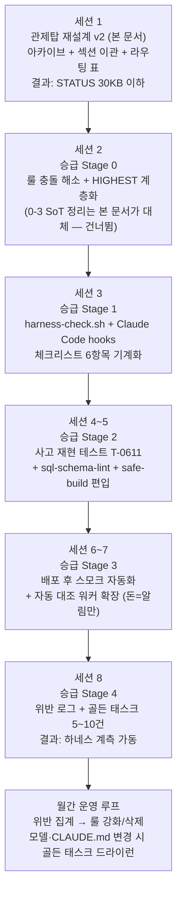

# [마스터 프롬프트 v2] STATUS 관제탑 재설계 — 라우팅 기반 문서 구조 전환

> 본 문서는 이전 "STATUS.md 아카이브 재설계" 프롬프트를 **대체**한다 (v1 폐기).
> 또한 "하네스 승급 마스터프롬프트"의 Stage 0-3(이중 SoT 정리)을 본 문서가 흡수한다 — 승급 Stage 0 실행 시 0-3은 건너뛴다.

CLAUDE.md의 모든 룰이 이 작업에도 적용된다.

## 절대 게이트 (0번 원칙 — 이 문서의 다른 어떤 지시보다 우선)

**모든 파일의 생성·수정·삭제는 예외 없이 [브리핑 → Harold 명시 승인 → 실행] 순서를 거친다.** 백업, 아카이브, 인덱스, 신규 문서, CLAUDE.md diff, 임시 파일과 그 삭제까지 전부다. "이 문서에 지시가 있으니 승인받은 것"으로 간주 금지 — 이 문서는 계획서일 뿐, 개별 실행 승인이 아니다. git/SSH/배포 직접 실행 금지, 완료 선언 = 검증 증거 첨부.

---

## 목표 구조: 3계층 관제탑

```
[계층 1 — 상시 로드]  세션마다 반드시 읽음. 합계 목표 60KB 이하.
  CLAUDE.md            행동 룰 단일 소유 (모든 룰·체크리스트·워크플로우)
  status/STATUS.md     관제탑: 현재 상태 + 라우팅 표. 목표 30KB 이하.

[계층 2 — 라우팅 조회]  라우팅 표가 지시하는 상황에서, 해당 절만 읽음.
  SCHEMA.md / OPS.md / BUGS.md / lessons/LESSONS_*.md
  status/ARCHITECTURE.md (신규 — 시스템 구조·CT 참조)
  status/DECISIONS.md   (신규 — DECISION LOG 이관)
  status/RISKS.md       (신규 — RISK REGISTER 이관)
  docs/* (기능정의서·비전 문서)

[계층 3 — 아카이브]  사고 조사·회귀 의심 시에만 인덱스 경유 조회.
  status/archive/INDEX.md → status/archive/TASKS_YYYY-MM.md
```

**구조 불변 원칙 (신규 룰로 CLAUDE.md에 추가):**
1. 행동 룰은 계층 1 밖으로 이동 금지 (분리 = 미적용).
2. 문서 소유권 — 정보 하나 = 소유 문서 하나. 타 문서는 링크만, 복사 금지.
3. 신규 문서 생성 시 라우팅 표 등재 의무. 라우팅 표는 한 화면(약 25행) 상한 — 초과 시 문서 통폐합 먼저.
4. `@import`로 계층 2·3 문서를 계층 1에 연결 금지 (자동 로드되어 분리 목적 붕괴). 링크 참조만.

---

## 작업 단계 (순서 준수, 각 단계 승인 게이트)

### 1. 백업 + 현황 기록
```
cp status/STATUS.md status/STATUS.md.bak-$(date +%Y%m%d)
wc -l -c status/STATUS.md
```
줄 수·바이트를 기록해 보고.

### 2. 전수 분류 보고 → Harold 승인 대기
STATUS.md 전 섹션에 대해 목적지 분류표를 보고한다. **승인 전 어떤 파일도 생성·수정 금지.**

| 섹션 | 목적지 | 비고 |
|------|--------|------|
| §0 사용법 | STATUS 잔류 (축소 재작성) | 라우팅 표 사용법으로 교체 |
| §1 페르소나 | CLAUDE.md 이관 후 삭제 | CLAUDE.md에 없는 고유 내용만 이관 — 이관 목록 전문 보고 |
| §2 절대 원칙 | CLAUDE.md 이관 후 삭제 | 동일 (예: 백업 필수, 127.0.0.1 바인딩, 배포 전 tsc) |
| §3 워크플로우 | CLAUDE.md 이관 후 삭제 | 동일 |
| §4 CURRENT_TASK | 활성만 잔류, 완료분 아카이브 | 아래 분류 기준 |
| §5 발송 파이프라인 절대 보호 | CLAUDE.md 이관 | 룰이므로 계층 1 (분리 금지 원칙) |
| §6 시스템 아키텍처 | status/ARCHITECTURE.md 신규 이관 | |
| §7 핵심 아키텍처 참조 | status/ARCHITECTURE.md 이관 | |
| §8 TODO | STATUS 잔류 | |
| §9 DECISION LOG | status/DECISIONS.md 신규 이관 | STATUS에는 최근 5건 1줄 요약만 |
| §10 ASSUMPTION LEDGER | STATUS 잔류 | |
| §11 RISK REGISTER | status/RISKS.md 신규 이관 | STATUS에는 활성 상위 5건 1줄 요약만 |
| §12 DONE LOG | STATUS 잔류 (10건 룰 유지) | 초과분은 archive/INDEX.md 등재 |

CURRENT_TASK 분류 기준 — **잔류:** 진행 중(배포 미완료·잔여 실측·"다음 세션" 표기) + 최근 7일 이내 완료. **이동:** 그 외 완료(★배포완료) 전부. `[잔류/이동] 날짜 (순번) — 제목 1줄` 전체 목록으로 보고.

### 3. 아카이브 생성 (승인 후)
- `status/archive/TASKS_YYYY-MM.md` (완료 월 기준 분할) — **원문 그대로 이동, 요약·재서술 금지** (사고 조사 시 원문이 증거). 각 파일 상단에 원본 출처 헤더.
- `status/archive/INDEX.md` — 전 항목 1행씩: `| 날짜 | 제목 | 검색 키워드 | 파일링크 |`. 키워드는 원문에 실제 등장하는 파일명·함수명·테이블명·CT명·증상 단어만 추출 (임의 창작 금지).

### 4. 계층 2 신규 문서 생성 (승인 후)
ARCHITECTURE.md / DECISIONS.md / RISKS.md — 해당 섹션 원문 그대로 이관 + 상단에 소유권 헤더:
```
> 이 문서가 [시스템 구조/의사결정/리스크]의 유일한 소유 문서다. 타 문서에는 링크만 존재한다.
```

### 5. CLAUDE.md 이관 + 룰 추가 (diff 승인 후)
- §1·§2·§3·§5의 고유 내용 이관 (기존 룰과 중복되면 이관하지 않고 중복 판정 근거 보고).
- 신규 룰 2건 추가:
```
<RULE id="doc_routing" priority="HIGH">
  세션 상시 로드는 CLAUDE.md + status/STATUS.md 둘뿐이다.
  그 외 모든 문서는 STATUS.md 라우팅 표가 지시하는 상황에서, 지시된 범위(해당 절/항목)만 읽는다.
  문서 전체 로드 금지. 아카이브는 archive/INDEX.md grep 경유로만 진입한다.
  아카이브·과거 문서와 현재 코드가 다르면 현재 코드가 진실이다.
</RULE>
<RULE id="doc_ownership" priority="HIGH">
  정보 하나 = 소유 문서 하나. 타 문서에 복사 금지, 링크만.
  행동 룰은 CLAUDE.md 밖으로 이동 금지 (분리 = 미적용).
  신규 문서 생성 시 STATUS.md 라우팅 표 등재 의무. 라우팅 표 25행 초과 시 통폐합 먼저.
  STATUS.md 30KB 초과 = 회전 룰 미이행으로 간주 — 즉시 아카이브 회전 수행.
</RULE>
```

### 6. STATUS.md 관제탑 v2 작성 (골자 승인 후)
새 STATUS.md 구성 (이 순서대로):
```
# 한줄로 — 관제탑 (STATUS)
> 상시 로드 문서. 30KB 상한. 룰의 원천은 CLAUDE.md, 이 문서는 상태와 라우팅만.

## 1) 라우팅 표 — 이런 경우엔 이 문서
| 상황 | 참조 문서 | 읽는 범위 |
|------|-----------|-----------|
| DB 쿼리 작성 / 스키마 확인 | SCHEMA.md | 대상 테이블 절만 |
| DB·돈·환불·마이그레이션 작업 | lessons/LESSONS_DB.md | 도메인 전체 |
| Frontend·UI·모달 작업 | lessons/LESSONS_FRONTEND.md | 도메인 전체 |
| Backend·API·발송·AI 작업 | lessons/LESSONS_BACKEND.md | 도메인 전체 |
| 배포·빌드·SSH·의존성 | lessons/LESSONS_DEPLOY.md + OPS.md | 도메인 전체 / 해당 절 |
| 매 답변 직전 | lessons/LESSONS_META.md | 전체 (경량 유지 전제) |
| 컨트롤타워·도메인 흐름 | lessons/LESSONS_ARCHITECTURE.md | 해당 CT |
| 시스템 구조 파악 | ARCHITECTURE.md | 해당 절만 |
| 버그 수정 | BUGS.md | 해당 버그 항목 |
| 과거 작업 조회·회귀 의심 | archive/INDEX.md → TASKS_YYYY-MM.md | grep 적중 항목만 |
| 의사결정 배경 확인 | DECISIONS.md | 해당 ADR |
| 리스크 전체 확인 | RISKS.md | 전체 |
| AI Operator·CDP·Provider | docs/AI_OPERATOR_기능정의서.md | 해당 절 |
| 장기 로드맵·비전 | docs/한줄로_BEYOND_BRAZE_비전.md | 해당 절 |

## 2) CURRENT_TASK (활성 작업만)
> 회전 룰: ★배포완료 후 7일 경과 항목 → archive/TASKS_YYYY-MM.md 원문 이동 + INDEX 등재.

## 3) TODO
## 4) 가정 목록 (ASSUMPTION LEDGER)
## 5) 활성 리스크 상위 5 (1줄 요약 — 전체는 RISKS.md)
## 6) 최근 결정 5건 (1줄 요약 — 전체는 DECISIONS.md)
## 7) DONE LOG (최근 10건 — 초과분은 archive/INDEX.md)
```

### 7. 검증 (완료 보고 전 필수 — 증거 첨부)
1. **텍스트 보존:** 원본 줄 수 = (신 STATUS + 신규 문서들 + 아카이브) 이동분 합계 + 삭제된 중복분 명세. 계산식으로 보고. 중복 판정으로 삭제한 줄은 전문 목록 첨부.
2. **잔존 0건:** 이동한 각 섹션·항목의 식별 문자열 grep — 신 STATUS.md 잔존 0건 결과 첨부.
3. **크기:** `wc -c` — STATUS.md 30KB 이하, CLAUDE.md 증가분 보고.
4. **링크 무결성:** 라우팅 표·INDEX의 전 링크 대상 파일 존재 확인.
5. **표본 대조:** 이관 항목 5건(섹션별 1건+) 원문 일치 확인.
6. **라우팅 자가 시험:** "환불 사고 이력 확인" / "3주 전 DM 추적 수리 내용 확인" / "발송 파이프라인 보호 규칙 확인" 3개 질의에 대해 라우팅 표만으로 정확한 문서·절에 도달하는지 경로를 서술로 증명.

### 8. 완료 보고
검증 6종 증거 + 신규/수정/삭제 파일 목록 + 표준 종료 멘트:
"작업이 완료되었습니다. Harold님, 직접 git add/commit/push 및 배포를 진행해 주세요."

---

## 전체 실행 순서도 (이 문서 + 하네스 승급 프롬프트)



텍스트 순서 (mermaid 미지원 환경용):
1. **세션 1 — 본 문서 실행.** 관제탑 전환. 이후 모든 세션의 컨텍스트가 가벼워지므로 반드시 최우선.
2. **세션 2 — 승급 Stage 0.** 룰 충돌·계층화만 (SoT 정리는 완료됨).
3. **세션 3 — 승급 Stage 1.** 훅 게이트 가동. 이후 세션부터 형식 위반이 기계 차단됨.
4. **세션 4~5 — 승급 Stage 2.** 재현 테스트 + SQL lint.
5. **세션 6~7 — 승급 Stage 3.** 스모크 + 대조 워커.
6. **세션 8 — 승급 Stage 4.** 계측 가동.
7. **이후 월간 루프.** 위반 집계로 룰을 늘리는 게 아니라 다듬는다.

순서 근거: 문서 경량화(1)가 모든 후속 작업의 토큰·주의력 비용을 낮추고, 룰 일관성(2)이 게이트 구현(3~)의 기준을 확정하며, 훅(3)이 가동된 뒤의 작업(4~)은 훅의 보호 아래 진행된다.
